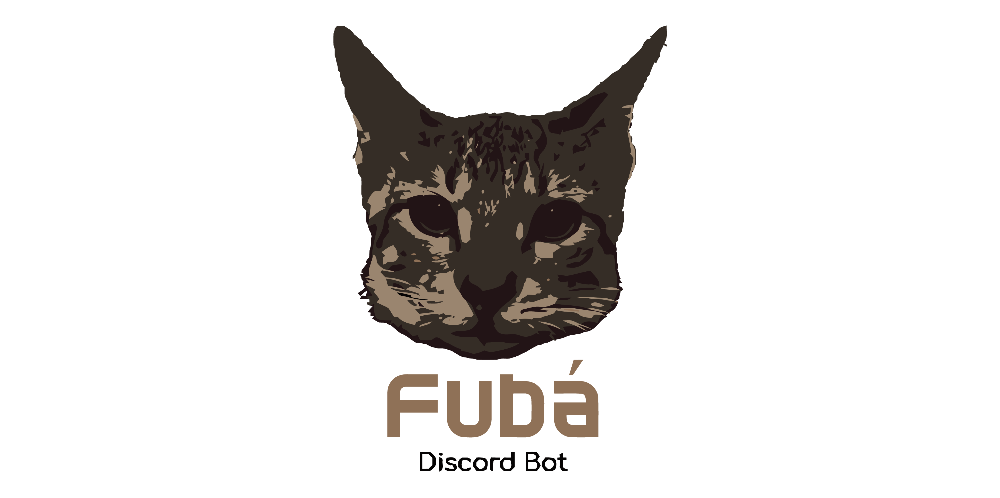

<div align="center">
  <br />
  
  <br />
  <p>
    
    
    <a href="https://github.com/thalesmacena/fuba-discord-bot/commits/main">
      
    </a>
  </p>
</div>

## 🗂 Tabela de Conteúdo
- [🗂 Tabela de Conteúdo](#-tabela-de-conteúdo)
- [📑 About](#-about)
- [💻 Technologies](#-technologies)
- [✨ Installation](#-installation)
- [⚙️ Config](#️-config)
- [🔥 Running](#-running)
- [🐱 About Fubá (the cat)](#-about-fubá-the-cat)
  
  
## 📑 About
Fubá is a [Discord Bot](https://discord.com/developers/applications) made in [Node.js](https://nodejs.org/en/) using the [Discord.js library](https://discord.js.org/#/). The bot has music commands, which access the youtube api and work with [Node's redable stream object] and playing with [ffmpeg]. In addition, it also has simple commands that work only with the discord api, such as clearing messages and making polls.

## 💻 Technologies

<a href="https://yarnpkg.com/"></a>

<a href="https://nodejs.org/en/"></a>

<a href="https://www.typescriptlang.org/"></a>

<a href="https://eslint.org/"></a>

<a href="https://discord.js.org/#/"></a>

<a href="https://discord.js.org/#/"></a>

<a href="https://developers.google.com/youtube/v3"></a>

<a href="https://www.ffmpeg.org/"></a>


## ✨ Installation
Open a terminal and run the following commands:

```PowerShell
# To copy this repository
git clone https://github.com/thalesmacena/fuba-discord-bot.git

# To move to project directory
cd fuba-discord-bot

# To install the dependencies
yarn
```

If you are going to run locally you need to install [FFmpeg](https://www.ffmpeg.org/), if you are going to run on a cloud service like Heroku, remember to install a dyno with FFmpeg

## ⚙️ Config
You need to configure some environment variables, so rename the `.env.example` file to `.env`. Then you need to change the values for discord variables. First go to the [discord application page](https://discord.com/developers/applications) and create an application, you can define a name and image for your application, then click on BOT and create a new bot. Copy the token and place it in DISCORD_TOKEN in the file. Then click on OAuth2 select the scope bot and administrator permissions (to save time), copy the link and enter in DISCORD_INVITE, you can access this url to invite the bot to a server. Finally, define a prefix for a character and insert it in DISCORD_PREFIX.

## 🔥 Running
You can run the application in development mode with the command:
```Powershell
# To run
yarn dev
```

in a few seconds the bot will login and load the commands. You can check the commands instruction by text {prefix}help.

## 🐱 About Fubá (the cat)
Fubá is my cat, if you like cats you can check his [instagram profile](https://www.instagram.com/gatofuba/)
